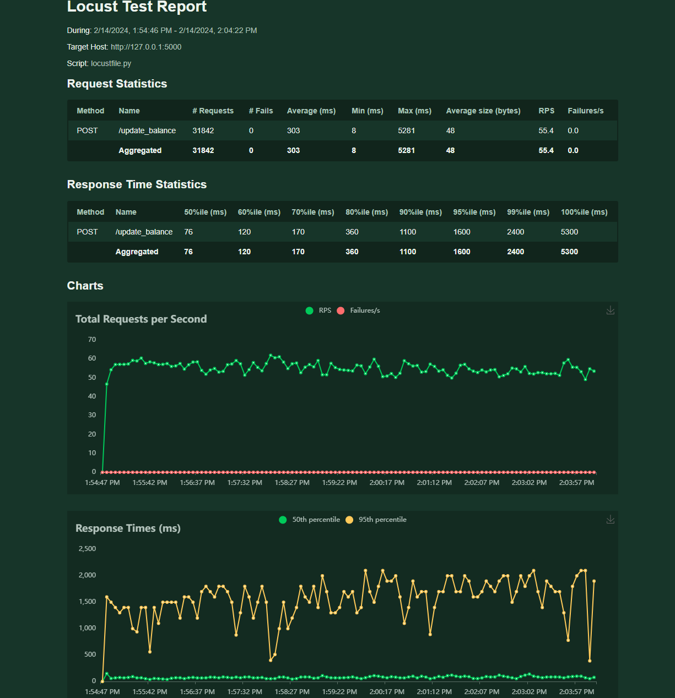

# Документация к веб-приложению на Flask

## Описание

Веб-приложение разработано с использованием фреймворка Flask и предназначено для управления списком пользователей с возможностью обновления 
их баланса на основе текущей температуры в выбранном городе. Приложение взаимодействует с SQLite базой данных для хранения информации о 
пользователях и использует внешнее [API](https://www.weatherapi.com/) для получения данных о погоде. Приложение не использует никаких асинхронных операций
(в т.ч. asyncio, aiohttp, aiosqlite) поскольку их имлементация вводит очереди и отложенные задачи, что запрещено ТЗ.

## Основные компоненты

### Класс `User`

Класс `User` представляет собой модель пользователя и содержит методы для взаимодействия с базой данных, включая добавление, обновление и удаление пользователей, а также обновление их баланса.

#### Методы класса:

- `get_user_by_id(user_id)`: Получение пользователя по ID.
- `add_user(username, balance)`: Добавление нового пользователя.
- `delete_user(user_id)`: Удаление пользователя по ID.
- `update_balance(amount)`: Обновление баланса пользователя.

### Функция `fetch_weather(city)`

Функция `fetch_weather(city)` использует внешнее API погоды для получения текущей температуры в указанном городе. Результат используется для обновления баланса пользователя.

### Маршрут Flask для обновления баланса

Приложение содержит маршрут `/update_balance`, который принимает параметры `userId` и `city`, обновляет баланс пользователя на величину, равную текущей температуре в указанном городе, и возвращает результат операции.

## Устойчивость к нагрузке

Для обеспечения устойчивости приложения к высоким нагрузкам были реализованы следующие механизмы:

- **Кэширование данных о погоде**: Введено кэширование результатов запросов к API погоды с целью снижения количества обращений к внешнему сервису и ускорения ответов на повторные запросы.
- **Оптимизация работы с базой данных**: Использование контекстных менеджеров для управления соединениями с SQLite и внедрение механизма повторных попыток записи при возникновении ошибок блокировки базы данных.

## Тестирование производительности

Для тестирования производительности системы было использовано нагрузочное тестирование с помощью инструмента Locust. 
В ходе теста система подвергалась нагрузке в виде ~55 запросов в секунду в течение 10 минутного промежутка. 

Также отдельно был написан скрипт для отправки 1000 запросов единовременно, чтобы протестировать сценарий пиковой нагрузки.

В обоих случаях система прошла проверку.

### Результаты тестирования

